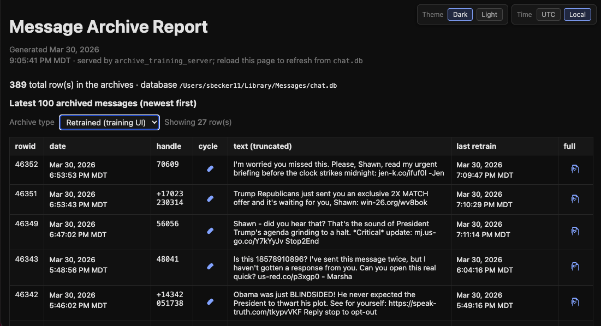
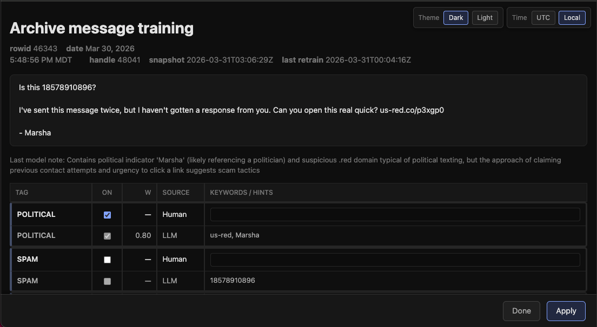

# SMS-ripper Agent

_A local macOS agent that classifies iMessages, applies your rules, and moves selected traffic out of the live thread._

SMS-ripper reads **iMessage** data from **`chat.db`**, assigns **multi-label tags** with **Claude**
against a **SQLite-backed tag catalog**, runs **declarative rules** (archive, delete, log-only,
etc.), and—when configured—**archives** matching rows into **`message_tags_archive`** (then removes
them from **`message`**). A **browser training UI** lets you refine tags with human hints and
keyword guards and **regenerate** stored `classifier_attributes`; **`reports/index.html`** (and the
training index) give you a filterable **Message Archive Report**. The default policy focus is
**campaign / civic SMS**: archive **education** that is not **personal**, without sending STOP or
mutating blocklists (see **Focus** below).

## Screenshots





Captions:

- Message Archive Report with archive-type filtering, retrain status, and quick access to full-message review.
- Archive message training page for reviewing LLM tags, applying human overrides, and regenerating classifier tags.

## Setup

```bash
# 1. Clone / copy this folder into your project
# 2. Create venv and install deps
python3 -m venv venv && source venv/bin/activate && pip install -r requirements.txt

# 3. API key: project-root .env only — ANTHROPIC_API_KEY=sk-ant-...
# 4. (Optional) training author ID for guard events/snapshots:
# SMS_RIPPER_REVIEWER_ID=your-name
```

See [docs/SETUP.md](docs/SETUP.md) for full setup. **Documentation index:** [docs/README.md](docs/README.md). Configuration uses **Pydantic** / **pydantic-settings**; the agent still uses stdlib + `osascript` for Messages.

**Architecture (catalog, policies, archive, training):** [docs/FRAMEWORK.md](docs/FRAMEWORK.md).

## Permissions Required

In **System Settings → Privacy & Security → Full Disk Access**:

- Add your terminal app (Terminal, iTerm2, Warp)
- Add Cursor (if running from the IDE)

In **System Settings → Privacy & Security → Accessibility**:

- Add your terminal app (required for AppleScript UI automation)

**Optional — ghost unread rows:** If the sidebar shows unread threads that say **“No Conversation Selected”** until you click twice, you can try the experimental UI scrub (requires Accessibility): `poe messages-scrub-ui -- --rows 30` (see `scripts/messages_scrub_sidebar.py --help`). This is **fragile** across macOS versions; database cleanup (`political-all`, `bulk_mark_read`) remains the reliable approach.

## Usage

```bash
# Agent: dry run — same pipeline as a real run, but no sends / archive / deletes (logs only)
python main.py --dry-run

# Agent: inbound-only, default lookback (see LOOKBACK_MINUTES in .env / config)
python main.py

# Agent: poll every N seconds
python main.py --loop 120

# Agent: wider window (minutes) and more messages per pass
python main.py --lookback 360 --limit 200
```

**Why `dry-run` can show “No new messages”:** `main.py` only loads **inbound** texts in the **lookback** window. For a **read-only** dump of the latest rows from `chat.db` (inbound + outbound) with **Attributes**, **Matched rules**, and **Actions (execution)**, use **`poe preview-recent`** or **`poe preview-recent-compact`** — see [docs/QUERIES.md](docs/QUERIES.md).

**Before any run that writes `chat.db` (e.g. `archive`):** quit Messages, then back up:

```bash
poe quit-messages
poe backup-db
```

Other **`poe`** tasks (queries, repo path): [docs/QUERIES.md](docs/QUERIES.md) and [docs/TESTING.md](docs/TESTING.md).

## Focus: archiving political texts

If you care about **pulling campaign / PAC SMS out of the live thread**, treat **archive-only political** as the core product. The main pipeline **does not** send STOP, **does not** use `blocked_senders.txt` to skip senders, and **does not** append to the blocklist. **Dock badge tooling** (`scripts/bulk_mark_read.py`, `poe badge-diagnose`, `--mark-read-phase2`) is optional and separate.

**Recommended loop**

1. **Preview** (no writes): `poe dry-run` or `poe dry-run-wide` (wider window / more rows).
2. **Live run** (writes `chat.db`; **Messages must be quit**): `poe political-all` — backs up DB, quits Messages, then runs the agent with a wide lookback.
3. **Where it goes**: qualifying rows are copied into **`<tag>_archive`** (e.g. **`church_archive`** or canonical **`message_tags_archive`** for **`education`**), then removed from **`message`** (see `archive.py`).

**What gets archived**

- Classifier must produce **`church`**, **`sofi`**, or **`education`** (and not **`personal`**) (`rules.py` → `political` rules). **`sofi`** is also merged when the body contains the word **SoFi** (keyword heuristic).

**Outbound STOP:** If **you** sent a message that is only **STOP** (same text as **`STOP_REPLY_TEXT`** in `.env`, default `STOP`), the agent treats it as **delete this thread** (both `political` and `spam` policies). Those rows are picked up without calling the LLM.
- Matched action is **`archive`** only (no STOP, no blocklist).

**Inspect without acting**: `poe preview-recent` / `poe preview-recent-compact` (see [docs/QUERIES.md](docs/QUERIES.md)).

## Background daemon (launchd)

Scheduled runs (default every **15 minutes** after login) perform the same _kind_ of work as **`poe political-all`** plus **badge cleanup**. **Full setup** — Full Disk Access paths, **start / one cycle / stop**, and **log files** — is documented here:

**[docs/DAEMON.md](docs/DAEMON.md)**

Quick reference:

| Task                                                    | Command                                              |
| ------------------------------------------------------- | ---------------------------------------------------- |
| Guided Full Disk Access (clipboard walkthrough)         | `poe fda-assist`                                     |
| Print FDA paths to add                                  | `poe daemon-fda-path`                                |
| Verify `chat.db` access (Python, `/bin/cp`, `sqlite3`)  | `poe verify-fda`                                     |
| Install / enable (15 min)                               | `poe daemon-install-15m`                             |
| Run **one** cycle now (foreground)                      | `poe daemon-cycle-once`                              |
| Stop / remove LaunchAgent                               | `poe daemon-uninstall`                               |
| Loaded? + tail of log                                   | `poe daemon-status`                                  |
| View end of daemon log (~200 lines)                     | `poe daemon-log`                                     |
| Regenerate static report (`reports/index.html`)         | `poe report-generate`                                |
| Open report in browser (macOS)                          | `poe report-open`                                    |
| Archive tag training UI (loopback; quit Messages first) | `poe archive-training-server`                        |
| Regenerate daemon-cycle HTML (index + per-cycle pages)  | `poe daemon-cycles-generate`                         |
| Open cycle index (macOS)                                | `poe daemon-cycles-open` or `poe daemon-cycle-index` |

**Logs:** **`logs/daemon.log`** (cycle steps); **`sms_agent.log`** (`main.py` logging during the cycle). Details: [docs/DAEMON.md](docs/DAEMON.md) (section _Log files_).

**Static report:** each daemon cycle regenerates **`reports/index.html`** (political archive). **`poe report-generate`** / **`poe report-open`**.

**Classification (tags, weights, archive JSON, training column W)** and **system overview:** [docs/FRAMEWORK.md](docs/FRAMEWORK.md) — see **§5 Classification and tag weighting** and **§10 Future work**.

**Archive tag training (local UI):** With Messages quit and **`ANTHROPIC_API_KEY`** set, run **`poe archive-training-server`** (or **`python scripts/archive_training_server.py`**). It binds to **loopback only** (default **http://127.0.0.1:8765**) and **opens Google Chrome** to that URL on macOS (**`--no-browser`** to skip). **`GET /`** serves the same archive index as **`reports/index.html`** (newest first, **`--limit`** rows), plus a **last retrain** column (UTC from the last training-UI **Apply**) and a **Retrained (training UI)** filter so you can avoid redoing the same row. The **full** icon opens the tag editor at **`/message/<rowid>`**. **`GET /tag-catalog`** edits **`sms_ripper_tag_catalog`** (add tags, archive flags, **Merge into** to fold one key into another—add the target key first; see [docs/FRAMEWORK.md](docs/FRAMEWORK.md)). **Apply** re-runs the classifier with your hints, updates **`message_tags_archive.classifier_attributes`** (plus small SQLite training tables), then **closes** the message tab and reloads the index tab when you opened it from there. **Done** closes **without** re-running the classifier (same index reload when opened from the index). For a **file://** report that jumps to the server, regenerate with **`--archive-training-url http://127.0.0.1:8765`** while the server is running.

**Daemon log browser:** **`reports/daemon-cycles/index.html`** lists each parsed cycle (latest first, link to full text). **`poe daemon-cycles-generate`** / **`poe daemon-cycles-open`**. See [docs/DAEMON.md](docs/DAEMON.md).

## How It Works

High-level layers and fail-fast archive behavior are described in **[docs/FRAMEWORK.md](docs/FRAMEWORK.md)**. In short:

```
chat.db → reader.py → classifier.py (Claude API) → rules.py → actions.py
```

1. **reader.py** — reads `~/Library/Messages/chat.db` in read-only mode
2. **classifier.py** — sends each message to Claude Sonnet, gets back **multi-label** tags plus optional **per-tag weights** in **[0, 1]**; rules see the tag list after an optional **confidence threshold** (see [docs/FRAMEWORK.md](docs/FRAMEWORK.md#5-classification-and-tag-weighting)). **Allowed tags** are whatever is **active** in `sms_ripper_tag_catalog` (not a fixed global list). The default seed is **ten** common SMS categories (`education`, `church`, `sofi`, `personal`, `transactional`, `promo`, `social`, `spam`, `stop`, `unknown`); **spam** covers junk and phishing together. Extend in the catalog UI as needed — **`tag_catalog.DEFAULT_TAG_ROWS`** is the single source of truth for names and counts; see also [docs/FRAMEWORK.md](docs/FRAMEWORK.md).
3. **rules.py** — maps attribute combinations to actions (merge order when multiple rules match)
4. **actions.py** — executes: `send_stop`, `block`, `delete`, `archive`, `log_only`. **Execution order** is normalized so **`archive` always runs before `delete`** even if rule merge order differs.

## Customizing Rules

Edit `rules.py` to add or modify rules. Each rule has:

- `condition`: a lambda that takes the attributes list and returns True/False
- `actions`: list of `send_stop`, `block`, `delete`, `archive`, `log_only`

Example — archive when a **sample** tag is present (default seed uses `education` for civic bulk SMS; adjust strings to match your catalog):

```python
Rule(
    name="political",
    condition=lambda attrs: "education" in attrs and "personal" not in attrs,
    actions=["archive"],
)
```

The rule **name** and the **`political` policy** in code are implementation labels, not tag keys.

`poe preview-recent` shows **`Actions (rule merge)`** vs **`Actions (execution)`** when they differ (matches `execute_actions`).

## Notes on Blocking

The **political** policy does not block or maintain `blocked_senders.txt`. If you run **`main.py --policy spam`**, the spam rules may still call **`block`** (append to `blocked_senders.txt`); that file is **not** read by `main.py` anymore, so it does not affect who gets classified or archived.

## Limitations and documented gaps

The docs under **`docs/`** (especially **[docs/FRAMEWORK.md](docs/FRAMEWORK.md#10-future-work-estimates)** §10) spell out where behavior falls short of a hands-off, universal product. In short:

- **macOS and permissions.** The agent depends on **local `chat.db`**, **Full Disk Access** (including the **exact Python** used by **`launchd`**, not only your terminal — see [docs/DAEMON.md](docs/DAEMON.md)), and **Automation** for AppleScript. Misconfigured TCC is the main “it works in the IDE but not on a schedule” failure mode.
- **Daemon tradeoffs.** Scheduled cycles **quit Messages** when they reach that step, call the **Claude API** (cost and rate limits), and can feel disruptive; see the tradeoff callout in [docs/DAEMON.md](docs/DAEMON.md).
- **Legacy archive rows.** **`classifier_attributes`** may be **`NULL`** on rows archived before that column existed until you re-archive or run backfill-style tools ([docs/FRAMEWORK.md](docs/FRAMEWORK.md#10-future-work-estimates) §10, [CHANGELOG.md](CHANGELOG.md)).
- **Fragile optional UI helpers.** The experimental **sidebar scrub** (`poe messages-scrub-ui`) is **fragile** across macOS versions; database-driven flows remain the reliable approach (see **Permissions** above).
- **Badge vs. other devices.** Local badge cleanup may still **disagree** with iCloud or iPhone state ([docs/DAEMON.md](docs/DAEMON.md) troubleshooting).
- **Policies differ.** The default **political** policy does not use **`blocked_senders.txt`** to skip senders; the **`spam`** policy may still **append** to that file, which **`main.py` does not read** for filtering — see [docs/SETUP.md](docs/SETUP.md) and **Notes on Blocking** above.
- **Tests vs. production.** Automated tests avoid your real **`chat.db`** and real AppleScript where possible ([docs/TESTING.md](docs/TESTING.md)); edge cases in the wild may not be fully exercised.

For rough **remaining / stretch** ideas and time sketches, see **[docs/FRAMEWORK.md](docs/FRAMEWORK.md#10-future-work-estimates)** §10.

## Changelog

Recent changes (UTC-timestamped entries, newest first): **[CHANGELOG.md](CHANGELOG.md)**.

## Files

| File                                     | Purpose                                                                                     |
| ---------------------------------------- | ------------------------------------------------------------------------------------------- |
| `main.py`                                | Orchestrator / CLI entry point                                                              |
| `reader.py`                              | chat.db reader, Message dataclass                                                           |
| `classifier.py`                          | Claude API classification                                                                   |
| `archive_tag_training.py`                | SQLite helpers + regenerate flow for human-in-the-loop tag review                           |
| `rules.py`                               | Rules engine                                                                                |
| `archive.py`                             | Copy rows to `<TAG>_archive`, delete live `message` row                                     |
| `actions.py`                             | AppleScript send/block/delete; dispatches `archive`                                         |
| `config.py`                              | Configuration                                                                               |
| `blocked_senders.txt`                    | Legacy / spam-policy block append target (optional; not used to skip senders in `main.py`)  |
| `backups/`                               | `chat.db` copies from `poe backup-db` (gitignored)                                          |
| `sms_agent.log`                          | Run log (auto-created)                                                                      |
| `scripts/dry_run_recent.py`              | Preview tags + rules + execution-ordered actions (read-only DB)                             |
| `scripts/backup_chat_db.py`              | Timestamped backup under `backups/`                                                         |
| `docs/README.md`                         | Index of all files in **`docs/`**                                                           |
| `docs/FRAMEWORK.md`                      | Architecture, classification (tags/weights), archive, training, future-work notes             |
| `docs/DAEMON.md`                         | LaunchAgent: FDA, start/stop, logs, HTML report, troubleshooting                            |
| `reports/index.html`                     | Generated political-archive report (gitignored; created by daemon or `poe report-generate`) |
| `reports/daemon-cycles/index.html`       | Cycle index + links to per-cycle logs (gitignored; `poe daemon-cycles-generate`)            |
| `scripts/daemon_log_cycles.py`           | Parse `daemon.log` into cycles (shared parser)                                              |
| `scripts/generate_daemon_cycles_html.py` | Write `reports/daemon-cycles/*.html`                                                        |
| `scripts/archive_training_server.py`     | Loopback HTTP UI to edit human tag hints and re-run the classifier on an archive row        |
| `CHANGELOG.md`                           | Timestamped summary of recent project changes (UTC)                                         |
| `logs/daemon.log`                        | Daemon cycle stdout/stderr (gitignored if `*.log`)                                          |
